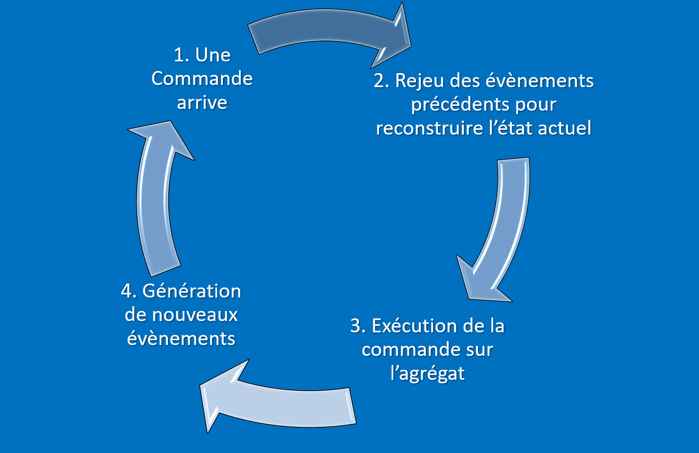
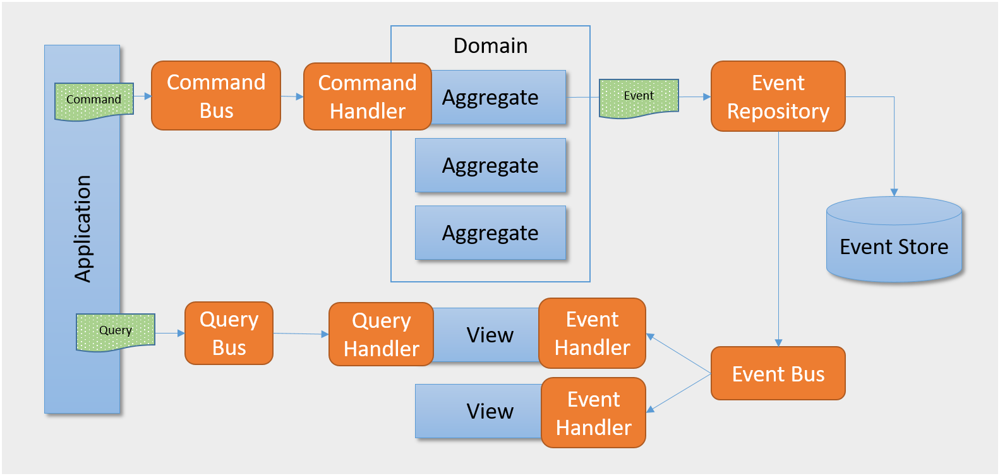

# CQRS 
# Event Sourcing 
avec le framework Axon

Note:

Aujourd'hui je voudrais vous faire découvrir l'event sourcing au travers du framework Axon.

---
# Event sourcing ??

C'est quoi ?

note: https://medium.com/tiller-systems/pourquoi-avoir-choisi-dutiliser-l-architecture-cqrs-e04c082f8b5f

---

Stocker les événements plutôt que les états

Note:

Souvent dans les applications on stocke les états: imaginer une table de base de données, par exemple
la base de données de DV dans résarail, ben y a tous les dv en l'état actuel des choses.

Le principe de l'event sourcing est de stocker non pas les états mais tous les changements (évenements) qui ont conduits
à l'état final.

---

Exemple d'état:

````json
{
    "numero": 123456,
    "propriétaire": "Jean Bon",
    "solde": { "valeur":15.0, "devise": "EUR" }
}
```` 

Note:

Exemple bateau. Ici on a un compte en banque. impossible de connaitre les opérations qui ont eu lieu dessus.
pour ce faire, il faut une autre table d'audit par exemple.

---

Version Event sourcing:

````json
    {
        "type_event": "ouverture_compte",
        "timestamp": 1528382470953,
        "numero": 123456,
        "propriétaire": "Jean Bon"        
    }
````
````json
    {
        "type_event": "compte_crédité",
        "timestamp": 1528382517707,
        "numero_compte": 123456,
        "montant": { "valeur":1515.0, "devise": "EUR" }
    }
````
````json
    {
        "type_event": "compte_débité",
        "timestamp": 1528382517900,
        "numero_compte": 123456,
        "montant": { "valeur":1500.0, "devise": "EUR" }
    }
````

Note:

On remarque tout de suite qu'on a beaucoup plus d'informations ici: par exemple on connait
la date de chaque opération, on voit l'évolution.

ça peut être utile. Par exemple: l'autre jour j'étais en conf avec des Gens de résarail qui cherchent à
retrouver quel canaux de ventes modifient des pnr en mode non sécurisé (cartes non pandorisées)
Et bien ils étaient incapable de savoir si l'accès via un mode non sécurisé avait eu lieu lors de la création du
pnr ou lors d'une opération d'après vente !

--- 

# Event Sourcing

Pourquoi on veut faire ça ??

* Auditabilité (en analysant les events)
* Performance (écritures uniquements)
* Reprise de données (en rejouant les events)

---

# Event sourcing: fonctionnement

---

> Un événement représente une modification de l'état d'un *agrégat*.

Les événements s'expriment toujours au passé. 

Ils sont immuables.

Ils sont stockés dans l'ordre dans un Event Store.

Ils sont diffusés via un Event Bus.

note: c'est l'application d'un événement sur un agrégat qui provoque la mutation de l'état
de l'agrégat. par exemple: on ne change le compte que lorsqu'on applique l'état "CompteDébité"  

--- 

## Créer des événements

Avec des commandes

---

> Une commande est une *intention* de modification d'une entité/agrégat.

Une commande peut:

* être rejetée,
* générer un ou plusieurs événements,
* n'avoir aucun effet. 

Note:

La commande génère des effets de bord: communication avec un partenaire extérieur, etc. 

---
Modification de l'état d'un agrégat



---
# Quel rapport avec CQRS ?

Commands Queries Responsability Segregation

note: on voit bien les commandes, c'est quoi les queries ?

---

*Projections*: vues adaptées pour un use case.

- Construites à partir des événements

- Performantes 

- Extensibles 

note: 
donner des exemples
performante: car requétable avec des requêtes simples
On peut en ajouter autant qu'on veut en fonction de l'évolution des uses cases

---

Architecture Event sourcing CQRS

 <!-- .element: style="max-width: 100%" -->

---
# Mise en oeuvre

> Vous pouvez (devez) faire sans framework.

[Lu sur un article de blog de Xebia sur l'Event Sourcing](http://blog.xebia.fr/2017/01/16/event-sourcing-comprendre-les-bases-dun-systeme-evenementiel/)

=> ??? en fait... c'est quand même bien pratique un framework. <!-- .element: class="fragment" data-fragment-index="0" -->

note: Ça c'est un gars qui n'a pas du faire beaucoup d'eventsourcing.
Sur son blog, il indique que les concepts derrière l'event sourcing sont tellement simple qu'il n'est pas
nécessaire d'utiliser un framework.

Dans mon expérience ce n'est pas le cas:

- Sur le *Hub de paiement*, nous avons utilisé l'ES mais avons pas mal galéré (pas de CQRS sur le hub,
  on rejoue pas les events...),
- Sur *hespéride*, le système d'ES est tellement compliqué qu'il a justifié la refonte complète de l'application.

D'où l'intérêt d'utiliser un framework.

---
# Axon framework

Démo

